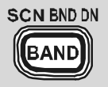

= AsciiDoc Notes
Tim Born <Timothy.D.Born@gmail.com>
v0.1, July 20, 2021
:toclevels 5:
:toc:
:icons: font

= References

. https://docs.asciidoctor.org/asciidoc/latest/
. https://asciidoc.org/userguide.html

= Useful AsciiDoc Stuff

NOTE: Remember the milk!

WARNING: do not drink sour milk

TIP: tip

CAUTION: caution

IMPORTANT: pay attention

TODO: what does a comment look like?

= Images

== Inline Images
There are two AsciiDoc image macro types, block and inline. As with all macros, the block and inline forms differ by the number of colons that follow the macro name. The block form uses two colons (::), whereas the inline form only uses one (:).

inline an image like this: 

== Image Properties

